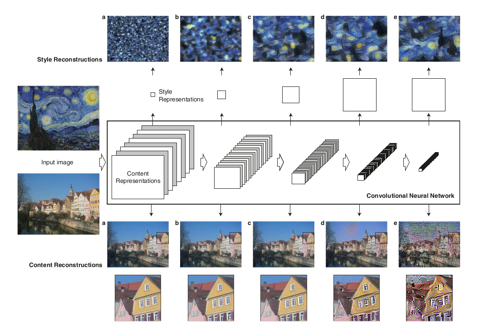
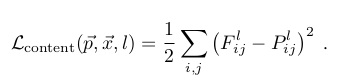
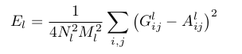
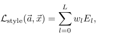
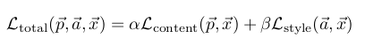

# StyleTransfer
Style transfer is a technique where we use two images 
- Content image which is the main content of the image
- Style image which could be termed as the layout of the image, something like a color scale in simplest of the terms

What style transfer does is that it takes the content of the content image and the style of the style image and merges them up to create an new image that resembles the content of the content image and the style of the style image

## CNN to capture the style and content of image

CNNs as we know are really awesome in detecting the representation of an image. An initial layer could detect just an edge of an image but as we go deeper it learns to detect even more complex structure of an image making it really useful for our purpose. For capturing the style and content of an image I have used the pretrained VGG19 network and extracted the features from the layers (conv1_1, conv2_1, conv3_1, conv4_1, conv5_1) respectively for both the style and the content although the paper does mention using second filters for the content image but the results were pretty similar so I decided not to.

## Creating a target image
The target image requires both the content of the image and the style of the style image

### Training the target image to be similar to the content

For training the target image such that it matches the content we first extract the features from the conv layers and then we use a loss function to improve the pixel values for the target image. In the image P and F represent the original image and the target image respectively and we compute this loss for the layer l

### Training the target image to match the style
  \
The training process is really different here. We used something called as gram matrix which helps us in getting the style representation of an image. It is nothing but a correlation between different filters in a layer L. So what we do is calculate the gram matrix for both the target(G) and the style image(A) to see how far it is from being similar to the style! \
Note: Constant 4*n^2*m^2 represent depth(channel) and height and width of the filter in layer l and the loss function sums up the value E in the image for all the layers multiplied by a weight factor which represents contribution of each layer

## Combined loss

We finally combine this loss to have a joint loss function which we will train our target image on. Alpha and beta image are hyperparameter which we can set to how much stylized the image should appear. A lower value of alpha/beta of order 10^-1 would mean an image that has not been stylized much.

## Examples
Some examples of stylized image

